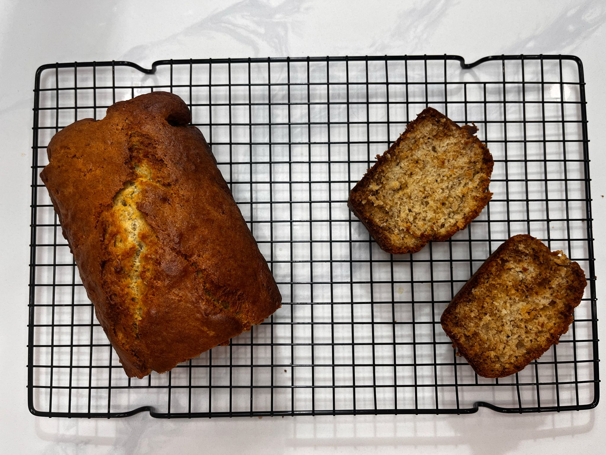

+++
title = "Banana Bread"
description = "The best banana bread is always the one baked at home!"
template = "prose.html"
insert_anchor_links = "none"

[extra]
lang = 'en'
comment = true
tags = ["baking"]
+++

# Banana Bread

🕑 **Total time:** 1h 30 mins 

⏲️ **Active time:** ~30 mins 

> This banana bread can be made with or without a mixer! The recipe works well doubled, making it perfect for sharing or freezing for later. Save bananas that are overripe in the freezer and use them later in this bread.

## Ingredients

| Quantity  | Ingredient                        | Weight         |
| --------- | --------------------------------- | -------------- |
| 1/2 cup   | butter                            | 115g           |
| 1/2 cup   | sugar (1 cup for a sweeter treat) | 100g (or 200g) |
| 2         | eggs                              |                |
| 1 cup     | very ripe bananas                 | 180g           |
| 1 3/4 cup | flour                             | 210g           |
| 1 tsp     | baking soda                       |                |
| 1/2 tsp   | baking powder                     |                |
| sprinkle  | salt                              |                |

## Instructions

1. Prepare the bowls: Use a small bowl for dry ingredients and a large bowl for wet ingredients.
2. In the small bowl, combine the flour, baking soda, baking powder, and salt.  
3. Cream butter and sugar:  
    - *Mixer method*: In the large bowl, cream the butter and sugar together on high speed.  
    - *Manual method*: Microwave the butter until just softened, then break it up with a flat spoon and mix well with the sugar.  
4. Add eggs to wet mixture:  
    - *Mixer method*: Beat each egg into the mixture individually.  
    - *Manual method*: Scramble all eggs thoroughly, add them slowly, and whisk until fully mixed.  
5. Separately, mash the bananas until only small pieces remain. Then beat them into the wet mixture.  
6. Slowly add the dry mixture into the wet mixture, stirring gently with a wooden spoon until just combined.  
7. Bake:  
    - Preheat oven to 350°F (175°C).  
    - Pour the batter into a greased or lined loaf pan.  
    - Bake in the lower oven rack for 50-60 minutes, or until a toothpick inserted in the center comes out clean.
8. Let the banana bread cool in the pan for 10 minutes, then transfer to a wire rack to cool completely before slicing.  

