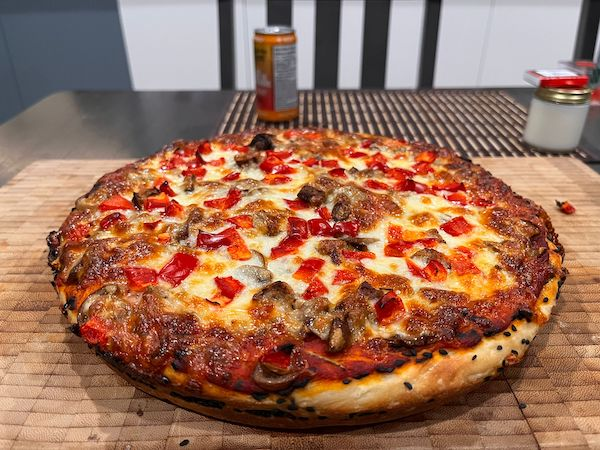

+++
title = "Cast Iron Pan Pizza"
description = "Something"
template = "prose.html"
insert_anchor_links = "none"

[extra]
lang = 'en'
comment = true
tags = ["cast-iron", "comfort-food", "slow food"]
+++

# Cast Iron Pan Pizza

🕑 **Total time:** +/-2 hours 

⏲️ **Active time:** 45 mins 

> This recipe has been meticulously crafted with cast iron pans in mind, allowing their unique properties to enhance both flavor and texture. 

The natural heat retention and even distribution of cast iron create the perfect environment for achieving a beautifully seared crust and rich, complex flavors that elevate every bite. Whether you’re a seasoned home cook or a passionate foodie, this dish is designed to bring out the best in your cast iron cookware, delivering exceptional results every time.

There are two parts:

- [Pizza dough](#pizza-dough)
- [Tomato paste](#sauce)

## Pizza dough

### Ingredients

- **400g bread flour** (about 2 1/2 cups), plus extra for dusting

- **10g kosher salt** (about 2 teaspoons), plus more for sprinkling

- **4g instant yeast** (about 1 teaspoon), such as SAF Instant Yeast

- **275g water** (about 1 cup plus 3 tablespoons)

- **8g extra-virgin olive oil** (about 2 teaspoons), plus more for greasing the pan and drizzling

- **1/2 package mozzarella**, shredded

- [Optional] Sesame seeds for sprinkling

### Instructions

1. Boil water to 75°C (167°F), then dissolve the salt in it. Allow the water to cool to below 50°C (122°F) to avoid killing yeast.
2. In a large bowl, combine the bread flour, yeast, water, and olive oil. Mix by hand or with a spoon until the dough comes together. It should be slightly wet and sticky. If the dough feels too dry, add a small amount of water.
3. Lightly coat a cast iron pan with olive oil. Place the dough in the pan, cover it with a towel, and proof it in an oven set to about 95°F (35°C) until the dough rises slightly.
4. Once the dough has risen a bit, gently press it out to the edges of the pan. Continue proofing for about 1 hour, allowing the dough to rise further.
5. After the dough has risen, press sesame seeds lightly into the edges. Add sauce as desired, and evenly distribute the mozzarella chunks over the surface of the pizza.
6. Preheat your oven to 550°F (290°C). Place a small pot of water inside the oven to create steam.
7. Bake the pizza on the bottom rack for 12–15 minutes, or until the cheese is browned and the crust is crispy.
8. Drizzle with olive oil and sprinkle with additional salt if desired. Enjoy!

## Sauce

### Sauce Ingredients

- **1 can tomato paste**
- **1/2 cup water**
- **1 teaspoon rosemary**
- **1 teaspoon oregano**
- **1 teaspoon salt**
- **1 tablespoon olive oil**
- **1 tablespoon sugar**
- **1 teaspoon butter**
- **pinch dried basil**

#### Sauce Instructions

1. In a small pan over low heat, melt the **butter**. Add the **rosemary** and **oregano**, and fry gently for about 30 seconds until fragrant.
2. Slowly add the full can of **tomato paste**, stirring to combine and mix properly.
3. Gradually pour in the **hot water**, stirring continuously to create a smooth consistency.
4. Once the mixture is fully combined, add a bit of **salt**, **sugar**, and a pinch of **basil**. Stir well.
5. Add **1 tablespoon of olive oil**, mix thoroughly, and let the sauce simmer for about 1 minute. Remove from heat and set aside to cool.
