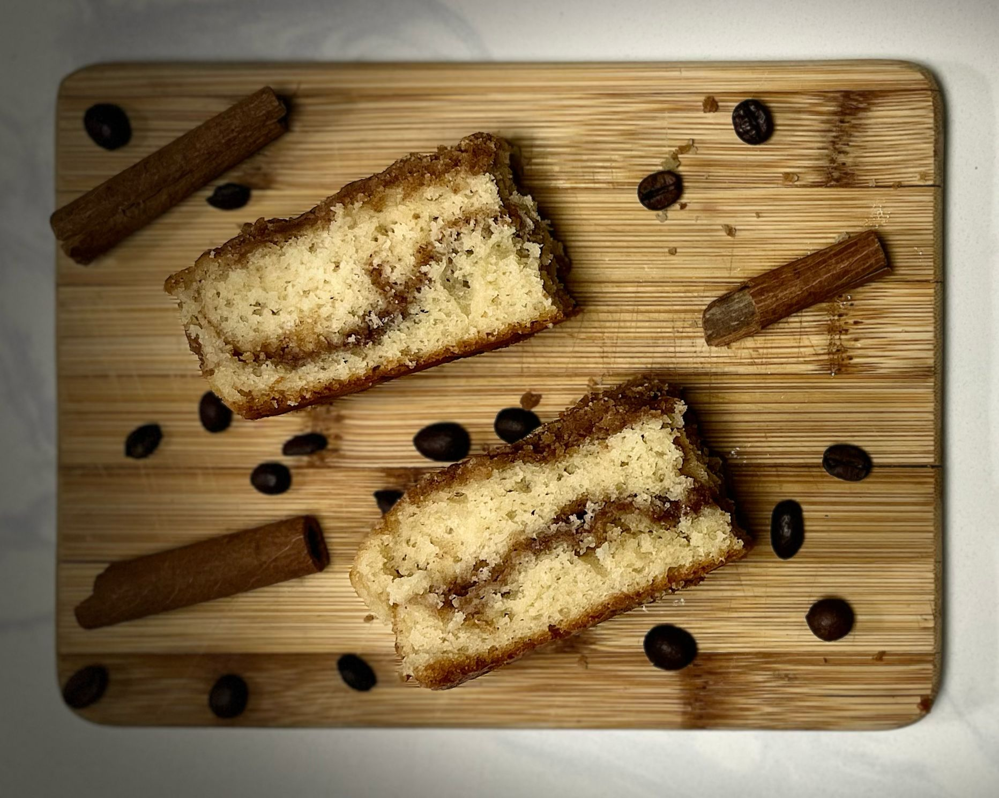
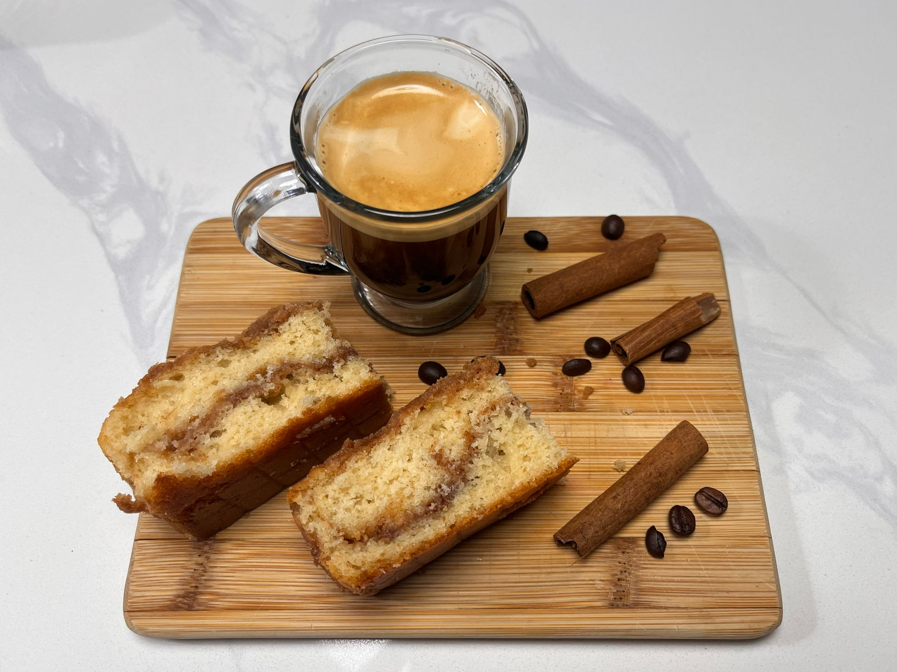

+++
title = "Cinnamon cake"
description = "A soft cake that pairs perfectly with your morning coffee."
template = "prose.html"
insert_anchor_links = "none"

[extra]
lang = 'en'
comment = true
tags = ["baking"]
+++

# Cinnamon Cake

🕑 Total time: 45 mins

⏲️ Active time: ~20 mins

> Work with cold butter and prepare an 8-ince pan before starting! Keeping the butter cold in the cinnamon mix is essential for achieving the perfect crumbly topping.

Baking is all about precision—small changes in measurements or techniques can make a big difference in the final result. For this recipe, I'll provide a more detailed step-by-step description to ensure everything turns out perfectly. By following these instructions closely, you'll achieve the best texture, flavour, and consistency for a delicious outcome.

## Getting Ready

**Choosing the right baking pan makes all the difference!** This recipe is designed for an 8-inch square tray, ensuring the perfect texture and bake. Since the batter is a bit tricky to work with, we want to make the most of every drop. A non-stick baking tray like [this](https://www.canadiantire.ca/en/pdp/paderno-professional-non-stick-square-cake-pan-8-x-8-in-1422884p.html) is ideal, but if you’re using a standard one, lining it with lightly greased parchment paper will help with an easy release. 

This recipe has two main parts:
- the [cinnamon crumb mixture](#cinnamon-crumb-mixture), and
- the [cake](#cake).

For each section there is a section for Ingredients and tools, and for the preparation.

## Cinnamon crumb mixture

### Ingredients and tools

- 2 and 1/2 teaspoons ground cinnamon
- 45g all-purpose flour
- 50g brown sugar
- 65g unsalted butter, cold cubed
- Pastry cutter or two forks

### Prepare crumb mixture

1. Combine brown sugar, flour and cinnamon in a mid-size bowl.
2. Whisk (or use a fork) to mix all your dry ingredients before adding the cold butter. 
3. Add the butter and mix the dry ingredients with your available tool until the crumbs reach a pea-size. Slightly bigger chunks is fine. 
4. Place it in the fridge. This mixture will be added to the batter when [assembling the cake in the pan](#assemble-the-cake-in-the-pan).

**Note:** It's key to leave the mixture refrigerated. A crucial step in this recipe is ensuring the butter stays cold before baking.

# Cake

## Ingredients and tools

- 166g all-purpose flour
- 1 teaspoon baking powder
- 1/4 teaspoon baking soda
- 1/4 teaspoon salt
- 113g unsalted butter, **softened to room temperature**
- 150g granulated sugar
- 2 large eggs **at room temperature**
- 2 teaspoons vanilla extract
- 120g plain yogurt **at room temperature**
- 30ml milk or cream
- Stand mixer with a paddle attachment
- Spatula

## Mix cake ingredients

5. Whisk the flour, baking powder, baking soda, salt in a med-size bowl. Set aside.
6. Set a stand mixer with a paddle attachment.
7. Beat the butter and sugar on high speed until smooth and creamy. Run for ~2 minutes.
8. Scrape down the sides of the bowl with a spatula to ensure everything is well combined.
9. Add the eggs and vanilla, then beat on medium-high until fully combined.
10. Add yogurt. Scrape down the sides again.
      **Note:** At this point it's expected that the mixture will be lumpy.
11. Slowly add the dry ingredients from step 5 into the wet mixture.
12. Add the milk (or cream). :warning: Do not overmix! It's important to keep a smooth consistency.
      **Note:** Batter will be thick and smooth. At this point you should have 2 and 1/2 cups of batter.

## Assemble the cake in the pan

13. Spread half of the batter into the prepared pan.
14. Spread half of the crumb mixture on top.
15. This step can be tricky! Spreading thick batter over a crumbly layer takes patience—just do your best, and it will come together!
16. Top with remaining crumbs.

## Bake

Bake for 30-35 minutes or until a toothpick inserted in the center comes out clean. Let the cake cool in the pan for 10 minutes before serving. This warm, cinnamon-scented cake is the perfect treat to enjoy with a cup of coffee, making any moment feel extra cozy and special.
 
